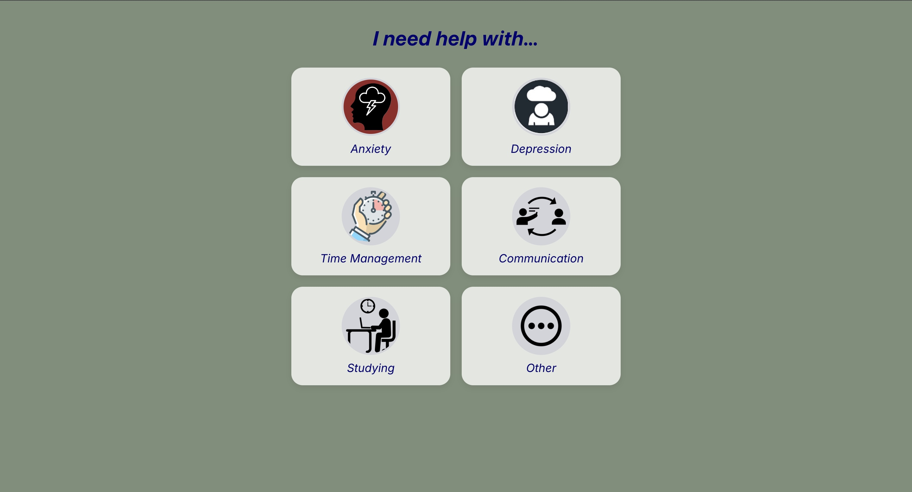
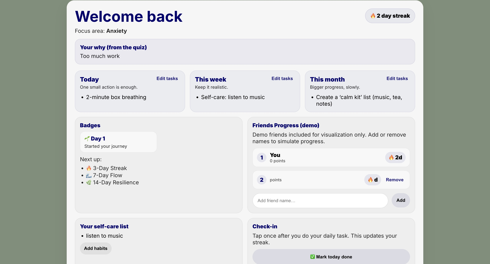
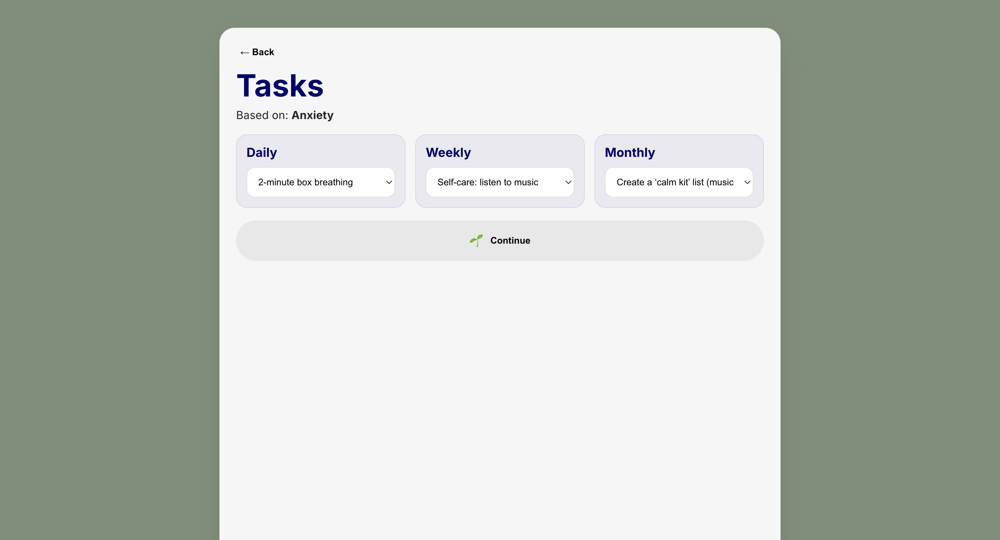
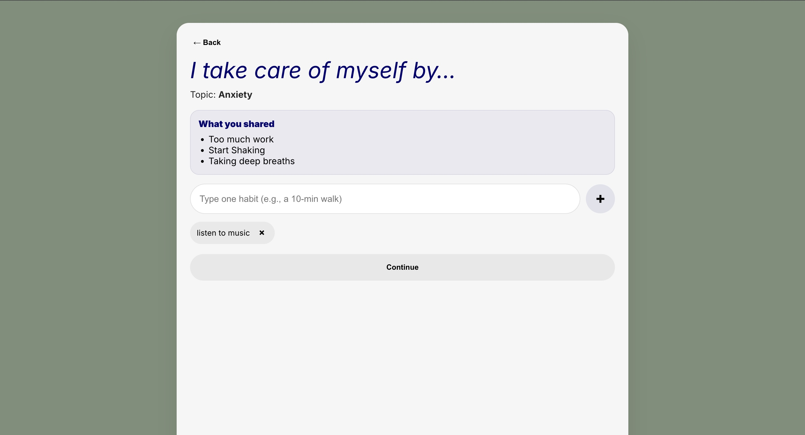
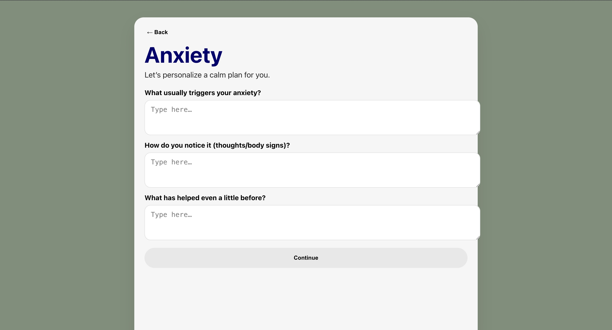

# SereneScape 🌿

SereneScape is a wellness-focused web application designed to encourage consistent self-care through gentle, non-invasive gamification.  
The application guides users through reflection, habit building, and task planning, then visualizes progress through streaks, badges, and a supportive dashboard.

This repository represents a **restored and refactored version of a mentored student project** originally developed approximately two years ago. The goal of this version is to ensure the project runs correctly, demonstrates clean front-end structure, and can be easily explored by others.

---

## ✨ Features

- Topic-based onboarding (Anxiety, Studying, Communication, etc.)
- Guided reflection and self-care habit input
- Personalized task planning (daily / weekly / monthly)
- Dashboard summarizing all progress
- Streak tracking with automatic progression
- Badge system for milestones (e.g. 3-day streak, 7-day streak)
- Friends leaderboard (**demo data only**)
- Persistent progress using browser localStorage
- Clean, calming UI with consistent visual theme

---

## 🛠 Tech Stack

- **React**
- **React Router**
- **JavaScript (ES6)**
- **Custom CSS**
- **Browser localStorage** (for persistence)

This project does **not** include a backend, database, or authentication system.

---

## 🚀 Getting Started

### Prerequisites
- Node.js (v16–18 recommended)
- npm

### Installation & Run

```bash
npm install
npm start

### 💾 Data Persistence

SereneScape stores all user progress locally in the browser using `localStorage`, including:

- selected focus topic  
- quiz responses  
- self-care habits  
- selected tasks  
- daily streak count  
- earned badges  
- leaderboard demo data  

Clearing browser storage or using a different device will reset progress.

---

### 🏅 Badges & Leaderboard

### Badges
Badges are awarded automatically based on:
- streak length  
- number of completed check-ins  

These are calculated dynamically and stored locally.

### Leaderboard
The leaderboard displays **demo friend data** to visualize social motivation and ranking behavior.  
Users can add or remove names to simulate progress.

> **Note:** No real user accounts or live social features are implemented in this prototype.

---

### 🧭 Project Scope & Status

> Originally developed as a mentored student project (2024) and restored/refactored in 2026.

This repository is intended as a **front-end prototype and learning artifact**, not a production-ready application.

Potential future extensions include:
- authentication  
- cloud-based data persistence  
- real-time social features  
- mobile-first optimization  

---

### 📸 Screenshots

### Home / Topic Selection


### Dashboard


### Tasks


### Planning


### Quiz



### 👩‍💻 Authorship & Credits

This project was originally developed by student developers as part of a mentored academic project.

**Orginal Contributors:**
- Eliza Anis
- Vaishnavi Guidimella
- Anya Liu
- Karmen Minhas
- Jathusaa Indrakumaran

**Mentors:**
- Jasleen Bakshi
- Anson Ruan

**Mentor, restoration, and refactor:**  
Jasleen Bakshi

The current version of this repository represents a restored, refactored, and documented version of the original project to ensure it runs correctly and reflects clean front-end architecture.
